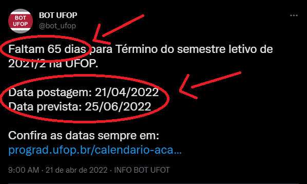

# BOT TWITTER UFOP

> Bot construído utilizando API do Twitter e JavaScript!

<h4>Bot construído para lembrar a comunidade acadêmica de datas especiais com postagens scriptadas!</h4>
<h4>Bot hosteado pela Heroku e ativado diariamente as 9:00AM, fazendo as verificações e as postagens se necessario.</h4>
<h4>Para visualizar o perfil do Bot, copie ou clique no link: <a href="https://twitter.com/bot_ufop">twitter.com/bot_ufop</a></h4>
<h2>Features:</h2>
<ul>
    <li>Função que reduz o Spam na timeline dos seguidores do Bot;</li>
    <li>Sinalização quando chegar o evento/data;</li>
    <li>Contagem de dias restantes para data em questão;</li>
    <li>Toda postagem possui a data que foi postada e a data prevista.</li>
</ul>
    

